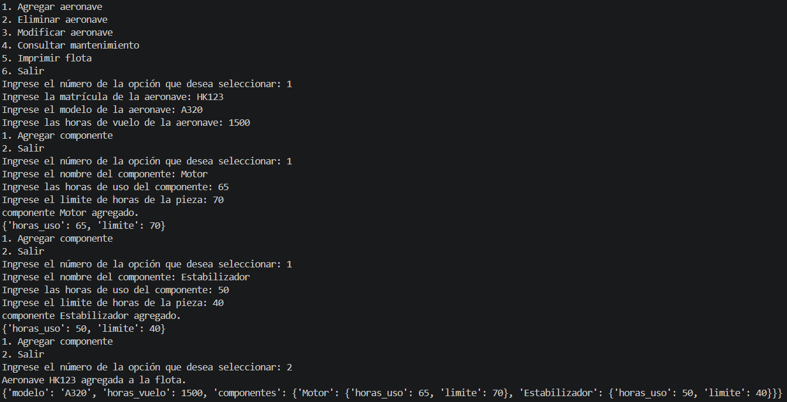
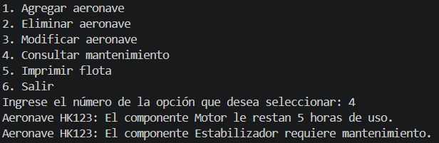

# 📝 Plantilla de Autoevaluación: Gestión de Mantenimiento de Flota Aeronáutica ✈️

**Instrucciones para los estudiantes:**
1. Hagan una copia de este archivo y guárdenlo en la raíz de su repositorio con el nombre `AUTOEVALUACION.md`.
2. Lean cuidadosamente cada criterio de la rúbrica.
3. En el apartado **Nota Esperada**, asignen una calificación numérica (de 0.0 a 5.0) que consideren justa para su trabajo en ese criterio.
4. En el apartado **Justificación**, expliquen con sus propias palabras por qué merecen esa nota. Sean críticos y honestos.
5. En el apartado **Evidencia**, inserten pantallazos de la ejecución de la consola, imágenes de su diagrama o bloques de código (usando la sintaxis de Markdown con \`\`\`) que respalden su justificación.
6. Al final, calculen su nota definitiva esperada según los porcentajes.

---

## 👥 1. Información del Equipo

* **Miembro 1:** Edilberto Contreras - 000586211
* **Miembro 2:** Simón Álvarez - 000583190

---

## 📊 2. Evaluación por Criterios

### Criterio 1: Diagrama y Lógica (Valor: 20%)
*Evalúa si el diagrama es claro, lógico y representa fielmente la estructura de datos utilizada (listas/diccionarios) y el flujo del programa.*

* **Nota Esperada (0.0 - 5.0):** 5.0
* **Justificación:** 
  > *Consideramos que merecemos un 5, porque desde la clase anterior preparamos con antelacion una serie de diagramas, interconectados entre ellos, que representaban los menus utilizados, y las diferentes funciones.*
* **Evidencia:**
  *### Menu:
  
  
  
  ### Agregar Aeronave:
  
  
  
  ### Modificar Aeronave:
  
  
  
  ### Eliminar Aeronave:
  
  
  
  ### Consultar Mantenimiento:
  
  *

### Criterio 2: Uso de Estructuras (Listas y Diccionarios) (Valor: 30%)
*Evalúa si se utilizaron diccionarios y listas de manera correcta y anidada para almacenar los datos ingresados por el usuario, sin redundancias.*

* **Nota Esperada (0.0 - 5.0):** 5.0
* **Justificación:**
  > *Utilizamos correctamente las diferentes estructuras de datos, especialmente diccionarios. Estos permitieron la facil busqueda de diferentes elementos, y una facil organización.*
* **Evidencia:**
  *Pega aquí el fragmento de código exacto donde inicializas y llenas estas estructuras. Usa el formato de código de Markdown:*
  ```python
  # Reemplaza esto con tu fragmento de código real
  matricula = input("Ingrese la matrícula de la aeronave: ")
  modelo = input("Ingrese el modelo de la aeronave: ")
  horas_vuelo = int(input("Ingrese las horas de vuelo de la aeronave: "))
  componentes = {}
  flota[matricula] = {"modelo": modelo, "horas_vuelo": horas_vuelo, "componentes": componentes}

### Criterio 3: Cumplimiento de Restricciones Técnicas (Valor: 20%)
*Evalúa el respeto total a las reglas: uso de ciclos clásicos (for/while), cero uso de list comprehensions, y ninguna librería/función avanzada no vista en clase.*

* **Nota Esperada (0.0 - 5.0):** 5.0
* **Justificación:**
    > *Todo el codigo fue diseñado por nosotros mismos, y no utilizamos ninguna función, o metodo no visto en clase.*
* **Evidencia:** *Pega un fragmento de código que demuestre cómo iteraste sobre los datos de forma clásica (sin atajos avanzados).*
  ```python
  def consultar_mantenimiento():
      for matricula, datos in flota.items():
          componentes = datos["componentes"]
          if not componentes:
              print(f"Aeronave {matricula} no tiene componentes registrados.")
              continue
          for nombre, datos_componentes in componentes.items():
              if datos_componentes["horas_uso"] > datos_componentes["limite"]:
                  print(f"Aeronave {matricula}: El componente {nombre} requiere mantenimiento.")
              else:
                  restante = datos_componentes["limite"] - datos_componentes["horas_uso"]
                  print(f"Aeronave {matricula}: El componente {nombre} le restan {restante} horas de uso.")


### Criterio 4: Funcionalidad del Código (Valor: 15%)
*Evalúa si el programa pide datos correctamente, no se "crashea" y genera el reporte final de mantenimiento esperado.*

* **Nota Esperada (0.0 - 5.0):** 4.7
* **Justificación:**
    > *[Describe la experiencia de uso. Ejemplo: "El programa puede almacenar con exito un numero indefinido de aeronaves, y se pueden agregar componentes a cada aeronave con facilidad. Además el programa permite modificar con facilidad toda la información de cada aeronave, y permite realizar el análisis del mantenimiento. En ocasiones muy escasas puede presentar errores, si se intentan eliminar elementos que no existen."]*
* **Evidencia:** *Inserta aquí 1 o 2 pantallazos () mostrando la terminal donde se vea:*
*El ingreso manual de datos.*
*El reporte final impreso en pantalla con las piezas que requieren mantenimiento.*



### Criterio 5: Preparación para Sustentación (Valor: 15%)
*Aunque esta nota la dará el profesor en la entrevista oral, autoevalúen su nivel de preparación y comprensión del código que entregaron.*

* **Nivel de Confianza (Bajo / Medio / Alto):** Alto
* **Justificación:**
    > *Los dos integrantes del equipo tuvimos un entendimiento muy alto del codigo, pues fuimos nosotros mismo quienes desarrollamos el codigo. Ambos pudimos responder todas las preguntas hechas con facilidad.*
* **Evidencia de preparación: Fue sencillo, desarrollamos el codigo al mismo tiempo y asi cada uno se especializó en la parte de codigo que realizó. y esa parte del codigo fue la que sustentó.**

### 📈 3. Cálculo de Nota Definitiva Esperada
Multipliquen la nota asignada en cada criterio por su porcentaje respectivo y sumen los resultados para obtener su nota final esperada.

|Criterio	|Nota |Asignada	|Peso	|Subtotal |(Nota * Peso) |
|---|---|---|---|---|---|
|1. Diagrama y Lógica	|5	|20% |(0.2)	|1|
|2. Uso de Estructuras	|5	|30% |(0.3)	|1.5|
|3. Cumplimiento Restricciones|	5	|20% |(0.2)	|1|
|4. Funcionalidad	|4.7	|15% |(0.15)	|0.705|
|5. Sustentación (Estimado)|	5|	15%| (0.15)|	0.75|

NOTA FINAL ESPERADA: 4.955	/	99.1%	

✨ ""La educación es para el carácter, no solo para la mente"." ✨